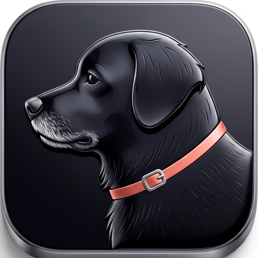

<p align="center">
  
</p>

# Lucy — Family AI Assistant

Lucy is a self-hosted AI assistant for household use. It runs entirely on a
home server, reachable both over Tailscale and publicly at
`lucy.tylersuits.com` behind a per-user login, answers questions using a RAG
(retrieval-augmented generation) pipeline over family documents/notes, can
ingest uploaded files and auto-organize them, and backs itself up to Google
Drive. All data storage and retrieval stays local — the LLM call itself
goes to the Gemini API (see "Why these choices" below for why that trade
was made), and the Drive backup is one-way (local → Drive only,
`drive.file`-scoped so it can only see files it created itself).

## Architecture

```
[Web/mobile client] --(Cloudflare Tunnel or Tailscale, HTTPS)--> [FastAPI backend on Omarchy server]
                                                    |                          |
                                          [JWT auth, SQLite]                   |
                                          (users/conversations/messages)       |
                        +---------------------------+---------------------------+
                        |                            |                          |
              [Gemini API (LLM)]          [Chroma (vector DB, embedded)]  [Local filesystem]
                        |                            |                          |
                        +----------- RAG query flow -+                          |
                                                                                 |
                                                                    [Local filesystem] --backup--> [Google Drive]
```

- **Backend**: Python, FastAPI
- **LLM runtime**: Gemini API (`gemini-3.1-flash-lite` by default) — see
  below for why this replaced a locally-run Ollama model
- **Vector DB**: Chroma, embedded (no separate server process)
- **Auth**: per-user login (bcrypt-hashed passwords, JWT bearer tokens);
  chat history is stored in SQLite, private per-user by default with an
  option to start a conversation flagged shared, visible to the whole
  household
- **Canonical storage**: local filesystem, Markdown as the primary note
  format, plus a folder for original uploaded files (PDFs, images, docx, etc.)
  — uploaded documents are retrievable by anyone in the household who asks
  (a shared family knowledge base, not siloed per-user)
- **Google Drive**: one-way daily backup via `rclone` (a systemd timer, not
  a Python dependency), scoped to Drive's `drive.file` permission
- **Remote access**: Tailscale mesh network, plus a Cloudflare Tunnel
  exposing `lucy.tylersuits.com` publicly, gated by the app's own JWT
  login and (recommended) a second Cloudflare Access wall — see "Why
  these choices" for why this changed from Tailscale-only
- **Frontend**: React/Next.js PWA (installable to iOS home screen), talks to
  the FastAPI backend over the same origin it's served from

## Why these choices

- **Gemini API over local Ollama**: originally ran a local model to keep
  everything on-box, but the server's 7.7GiB RAM couldn't handle it well —
  a single request pushed RAM usage to 7.1GiB and into swap. Moving the LLM
  call itself to Gemini's API removes that constraint entirely (nothing
  heavy to load locally) while keeping RAG, storage, and retrieval fully
  local — only the final generation step leaves the box, not the document
  store. Configured with billing enabled specifically because Google's free
  tier uses submitted content to improve their products; the paid tier
  doesn't, and at `gemini-3.1-flash-lite` pricing, family-scale usage costs
  cents.
- **Chroma over alternatives (Qdrant, Pinecone, etc.)**: embeds directly into
  the FastAPI process, so there's no separate database server to run and
  maintain on modest hardware. Plenty capable for a family-scale knowledge
  base (thousands of documents, not millions). Migrating to something like
  Qdrant later is possible since the RAG logic sits above the vector store.
- **Tailscale-only, later relaxed to a Cloudflare Tunnel**: originally
  restricted to Tailscale specifically to avoid any public attack surface.
  Revisited once the household wanted Lucy reachable without requiring
  Tailscale on every device (e.g. a guest device, or a phone with the VPN
  extension backgrounded/killed — a real failure mode hit in practice, see
  the dev log). A Cloudflare Tunnel avoids port-forwarding and gets
  automatic TLS, and the app now requires a JWT login on every request
  regardless of network path — Tailscale isn't the only thing standing
  between a request and the data anymore. Cloudflare Access (an optional
  second login wall in front of the tunnel) is recommended but not yet
  mandatory.

## Project status

Phases 1-4 are built: core chat loop, the RAG pipeline, a PWA frontend
reachable from any device over Tailscale (deployed and confirmed working on
the Omarchy server, `lucy-omarchy`), and file upload with LLM-based
auto-organization (`POST /upload` extracts text — PDF/docx/OCR — classifies
it, files it away, and makes it immediately searchable). Phase 5 (Google
Drive backup) is a documented setup path using `rclone` rather than app
code — a live OAuth app pulling from a shared
Drive folder was scrapped as too large a privacy footprint; local data now
backs up to Drive one-way instead. The LLM backend was later switched from
a locally-run Ollama model to the Gemini API to resolve persistent RAM
pressure on the server hardware — see "Why these choices."

Also built: per-user login (JWT, bcrypt-hashed passwords), SQLite-backed
chat history (private per-user by default, with a shared "family thread"
option), and the "uploaded by" provenance stamp on ingested documents.
Public exposure via a Cloudflare Tunnel at `lucy.tylersuits.com` is live
alongside Tailscale access.

## Non-goals (v1)

- No training or self-hosting a model — uses the Gemini API.
- No LoRA fine-tuning (not applicable now that the LLM is API-based, not
  self-hosted).
- No public sign-up — a fixed, household-scale user list created via
  `scripts/create_user.py`, not an open registration flow.
- Google Drive is sync-in/sync-out only, never the canonical database.

> Public internet exposure was originally a hard non-goal (Tailscale-only).
> Relaxed to an optional Cloudflare Tunnel once JWT auth existed as a real
> access-control layer independent of the network path — see "Why these
> choices" above. Tailscale access still works either way.

## Roadmap

### 1.0 — current

- FastAPI backend with per-user JWT auth
- RAG over household documents via Chroma
- Gemini-backed chat, with per-user and shared ("family") conversation
  history
- File upload with automatic categorization/filing
- One-way nightly backup to Google Drive
- Next.js PWA frontend, installable to iOS home screen
- Reachable over Tailscale, and publicly at lucy.tylersuits.com behind
  login

### 1.1 — planned

- `@`-mention Lucy in a shared/family chat, instead of every message
  going to her
- Push notifications for `@`-mentions and for finished long-running
  prompts
